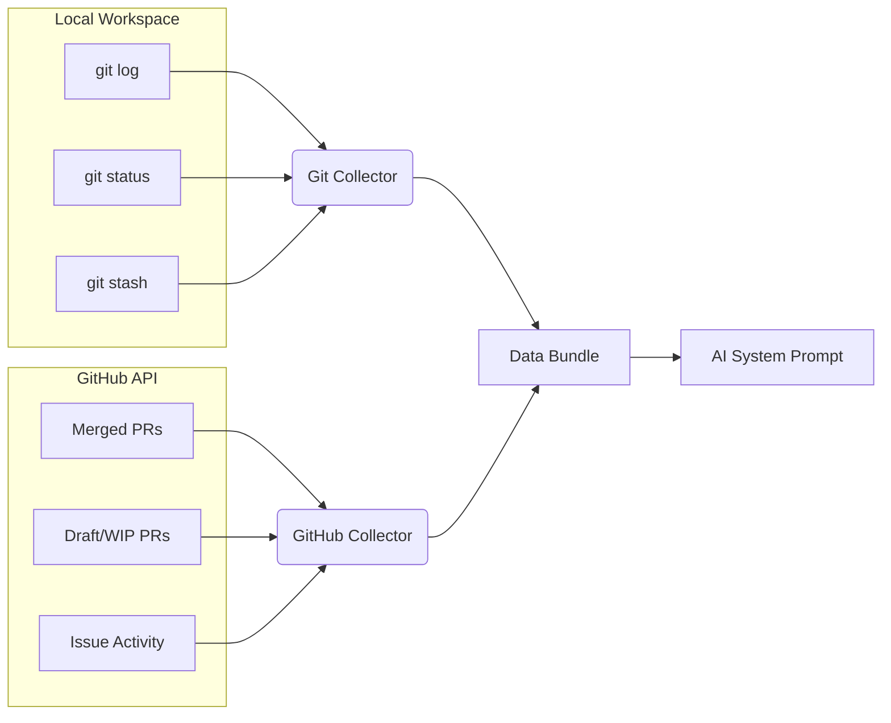

`git-brief` does not rely on a single `git log` command. To capture the full context of a developer's day, it runs multiple independent collectors concurrently.

## The Git Collector

The Git collector walks through your configured workspace directories and scans every repository. For each repo, it runs:

1. **`git log`**: Fetches all commits from the last 24 hours (or 72 hours on Mondays). It uses a custom delimiter string to securely parse the Author Name, Author Email, Commit Date (`%cI`), and the body of the commit to check for `Co-authored-by:` tags.
2. **`git status --porcelain`**: Reads your uncommitted working tree. It grabs up to 5 filenames you are currently modifying so the AI knows what you're actively building.
3. **`git log -g refs/stash`**: Reads your recent stashes, capturing work you had to put on pause.

## The GitHub Collector

If a GitHub token is provided, this collector runs three highly specific queries against the GitHub Search API:

1. **Merged/Reviewed:** `author:<user> type:pr merged:><date>` and `reviewed-by:<user> type:pr updated:><date>`
2. **Drafts:** `author:<user> type:pr updated:><date> -is:merged`
3. **Issues:** `involves:<user> type:issue updated:><date>`

It deduplicates the results by PR/Issue number and passes them to the AI pipeline.
